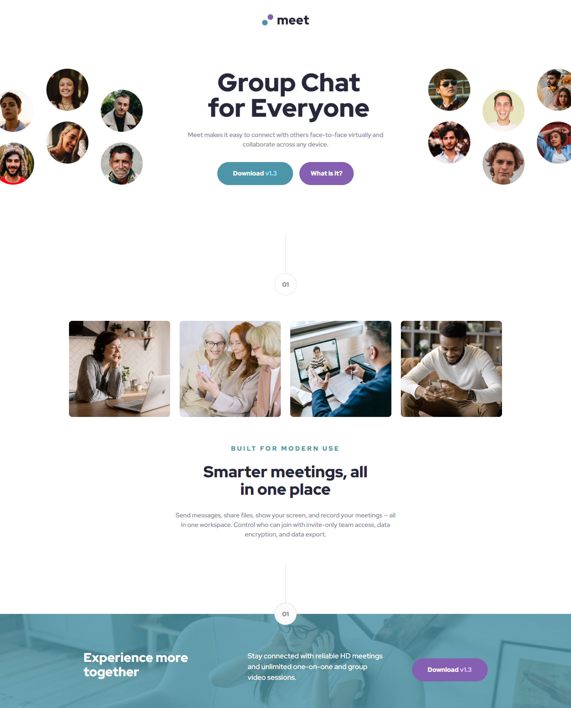

# Frontend Mentor - Meet landing page solution

This is a solution to the [Meet landing page challenge on Frontend Mentor](https://www.frontendmentor.io/challenges/meet-landing-page-rbTDS6OUR). Frontend Mentor challenges help you improve your coding skills by building realistic projects. 

## Table of contents

- [Overview](#overview)
  - [The challenge](#the-challenge)
  - [Screenshot](#screenshot)
  - [Links](#links)
  - [Built with](#built-with)
  - [What I learned](#what-i-learned)
- [Author](#author)

**Note: Delete this note and update the table of contents based on what sections you keep.**

## Overview

### The challenge

Users should be able to:

- View the optimal layout depending on their device's screen size
- See hover states for interactive elements

### Screenshot

### Links

- Solution URL: [Add solution URL here](https://github.com/Fanushhh/meet-landing-page)
- Live Site URL: [Add live site URL here](https://fanushhh.github.io/meet-landing-page/)

### Built with

- Semantic HTML5 markup
- CSS custom properties
- Flexbox
- CSS Grid
- Mobile-first workflow
- [React](https://reactjs.org/) - JS library

### What I learned

One thing I struggled with a lot was making images flow outside of the viewport without creating horizontal overflow. My first approach was to make make the images absolute, move them outside of the viewport and add a overflow: hidden to the container, however that caused images to dissappear. Ultimately, I ended up making the container have two background-images that are bigger than the size of the parent, causing them to look like they go outside of the viewport without causing scroll. So that's a mental note for future me.

## Author

- Website - [Fanushhh](fanushhh.github.io/Fanush-s-Portfolio/)
- Frontend Mentor - [@Fanushhh](https://www.frontendmentor.io/profile/Fanushhh)

